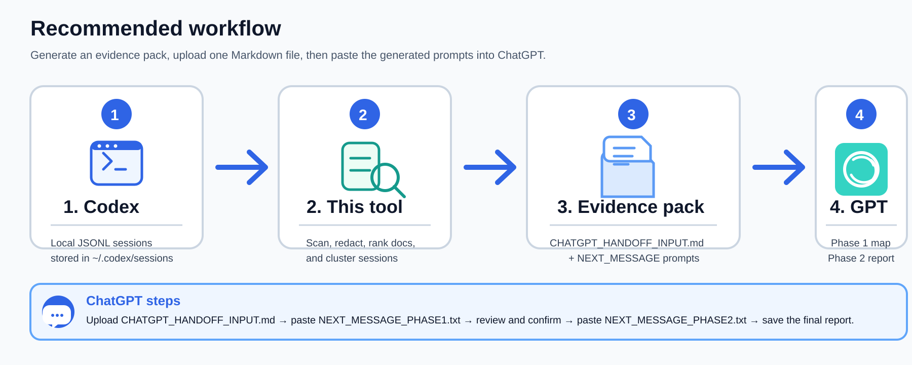

<p align="center">
  
</p>

<p align="center">
  <b>Turn local Codex session history into doc-first evidence packs for ChatGPT handoff and workspace history mapping.</b><br>
  <b>将本地 Codex 会话历史整理成可交给 ChatGPT 分析的文档优先证据包。</b>
</p>

<p align="center">
  
  
  
  
</p>

---

## English

### What is this?

`codex-session-handoff` is a **zero-dependency Python tool** for remote Linux servers where you may not have `sudo`, Node.js, npm, or even the `codex` command available.

It scans local Codex session JSONL files, ranks related revised Markdown documents, redacts common secrets, clusters repeated sessions, and produces a ChatGPT-ready evidence pack.

It is **not** a local AI summarizer. It prepares clean evidence so ChatGPT can do the semantic synthesis.

<p align="center">
  
</p>

### Best use cases

- Long-running research workspaces with many versioned experiment folders.
- AI coding agent handoff after many Codex sessions.
- Messy project directories where the latest revised Markdown files are more trustworthy than raw chat transcripts.
- No-admin servers where installing Node/npm/global packages is not possible.

### Installation

No installation is required.

```bash
python3 codex_handoff.py --help
```

Optional user-local command:

```bash
mkdir -p ~/.local/bin
cp codex_handoff.py ~/.local/bin/codex-handoff
chmod +x ~/.local/bin/codex-handoff
echo 'export PATH="$HOME/.local/bin:$PATH"' >> ~/.bashrc
source ~/.bashrc

codex-handoff --help
```

### Quick start: workspace history map

Use this when you want ChatGPT to understand the historical evolution of a messy workspace.

```bash
python3 codex_handoff.py --root ~/.codex/sessions history \
  /path/to/workspace \
  --history-depth balanced \
  -n 12 \
  -o ~/handoff_pack
```

Then in ChatGPT:

1. Upload `~/handoff_pack/CHATGPT_HANDOFF_INPUT.md`
2. Paste the contents of `~/handoff_pack/NEXT_MESSAGE_PHASE1.txt`
3. Review ChatGPT's Phase 1 output and add your corrections
4. Paste the contents of `~/handoff_pack/NEXT_MESSAGE_PHASE2.txt`
5. Save the final report

### Quick start: current workstream handoff

Use this when you want to hand off one active branch/focus directory.

```bash
python3 codex_handoff.py --root ~/.codex/sessions handoff \
  /path/to/focus \
  --workspace-root /path/to/workspace \
  -n 5 \
  -o ~/handoff_pack
```

### Output files

A generated pack usually contains:

```text
handoff_pack/
├── CHATGPT_HANDOFF_INPUT.md        # Upload this to ChatGPT
├── NEXT_MESSAGE_PHASE1.txt         # Paste this after upload
├── NEXT_MESSAGE_PHASE2.txt         # Paste this after Phase 1 review
├── PACK_SUMMARY.md                 # Human-readable pack overview
├── WORKSPACE_MAP.md                # Workstream directory map
├── DOCS_AUTHORITY.md               # Ranked revised Markdown documents
├── HISTORY_TIMELINE.md             # Session timeline
├── SESSION_CLUSTERING.md           # Representative vs duplicate/background sessions
├── SESSION_SELECTION.md            # Detailed session scoring
├── included_docs/                  # Selected docs copied into the pack
└── session_digests/                # Compact session digests
```

### Two-phase ChatGPT workflow

This tool intentionally separates evidence preparation from semantic judgment.

#### Phase 1: map and uncertainty list

Upload `CHATGPT_HANDOFF_INPUT.md`, then paste `NEXT_MESSAGE_PHASE1.txt`.

The model should produce:

- main workstreams;
- historical evolution;
- most trustworthy revised docs;
- superseded or uncertain branches;
- representative session clusters;
- questions requiring human confirmation.

#### Phase 2: final report or handoff

After you confirm or correct Phase 1, paste `NEXT_MESSAGE_PHASE2.txt`.

The model should produce the final Markdown report or handoff.

### Common commands

Scan local sessions:

```bash
python3 codex_handoff.py --root ~/.codex/sessions scan -n 20
```

Create a tiny outline for the latest session:

```bash
python3 codex_handoff.py --root ~/.codex/sessions outline latest -o latest_outline.md
```

Convert one session:

```bash
python3 codex_handoff.py --root ~/.codex/sessions convert latest --mode digest -o latest_digest.md
```

Batch-convert recent sessions:

```bash
python3 codex_handoff.py --root ~/.codex/sessions batch -n 20 --mode digest -o session_digests
```

Advanced pack command:

```bash
python3 codex_handoff.py --root ~/.codex/sessions pack \
  --workspace-root /path/to/workspace \
  --goal workspace-history \
  --filter-workspace \
  --auto-docs \
  --history-depth balanced \
  -n 12 \
  -o ~/handoff_pack
```

### Security notes

Generated files may contain project paths, command history, data filenames, and snippets from previous AI sessions. The tool redacts common secret-like values, but no regex redaction is perfect.

Before uploading or publishing generated packs, inspect them:

```bash
grep -RniE "api[_-]?key|secret|token|password|passwd|authorization|bearer|private key" ~/handoff_pack
```

Never commit your generated `CHATGPT_HANDOFF_INPUT.md`, session digests, or raw JSONL transcripts to a public repository.

### What this tool does not do

- It does not call an LLM.
- It does not understand your project semantically.
- It does not replace human judgment.
- It does not guarantee perfect secret redaction.
- It does not require `codex`, Node.js, npm, or sudo.

---

## 中文

### 这是什么？

`codex-session-handoff` 是一个**零依赖 Python 工具**，适合没有管理员权限的远程 Linux 服务器。你可能没有 `sudo`、Node.js、npm，甚至没有 `codex` 命令，但只要本地存在 `~/.codex/sessions/`，它就能工作。

它会扫描本地 Codex JSONL 会话，整理 revised Markdown 文档，脱敏常见密钥，聚类重复会话，并生成可以上传给 ChatGPT 的证据包。

它**不是本地 AI 总结器**。它只负责把材料整理干净；真正的语义判断交给 ChatGPT 和使用者。

### 适合什么场景？

- 长期科研项目，目录中有很多 v1、v2、v13、v16 等实验分支。
- 使用 Codex 多轮迭代后，需要交接给 ChatGPT 或另一个 AI coding agent。
- 项目目录较乱，但最新修改过的 README / LOGIC / HANDOFF / Results 等 Markdown 才是可信材料。
- 无管理员权限服务器，无法安装 Node/npm/global packages。

### 安装方式

不需要安装，直接运行：

```bash
python3 codex_handoff.py --help
```

可选：放入用户本地命令目录：

```bash
mkdir -p ~/.local/bin
cp codex_handoff.py ~/.local/bin/codex-handoff
chmod +x ~/.local/bin/codex-handoff
echo 'export PATH="$HOME/.local/bin:$PATH"' >> ~/.bashrc
source ~/.bashrc

codex-handoff --help
```

### 快速开始：历史演化梳理

当你想让 ChatGPT 理解一个混乱工作区的历史演化时，用这个命令：

```bash
python3 codex_handoff.py --root ~/.codex/sessions history \
  /path/to/workspace \
  --history-depth balanced \
  -n 12 \
  -o ~/handoff_pack
```

然后在 ChatGPT 中：

1. 上传 `~/handoff_pack/CHATGPT_HANDOFF_INPUT.md`
2. 复制 `~/handoff_pack/NEXT_MESSAGE_PHASE1.txt` 的内容并发送
3. 阅读 GPT 输出的第一阶段历史路线图和不确定点
4. 人工确认、修正、补充重点
5. 复制 `~/handoff_pack/NEXT_MESSAGE_PHASE2.txt` 的内容并发送
6. 获得最终报告

### 快速开始：当前分支交接

当你只想交接一个当前工作分支/方向时：

```bash
python3 codex_handoff.py --root ~/.codex/sessions handoff \
  /path/to/focus \
  --workspace-root /path/to/workspace \
  -n 5 \
  -o ~/handoff_pack
```

### 输出文件说明

```text
handoff_pack/
├── CHATGPT_HANDOFF_INPUT.md        # 上传给 ChatGPT 的主文件
├── NEXT_MESSAGE_PHASE1.txt         # 上传后复制到对话框的第一阶段 prompt
├── NEXT_MESSAGE_PHASE2.txt         # 人工确认后复制到对话框的第二阶段 prompt
├── PACK_SUMMARY.md                 # 证据包概览
├── WORKSPACE_MAP.md                # 工作区分支地图
├── DOCS_AUTHORITY.md               # revised Markdown 文档可信度排序
├── HISTORY_TIMELINE.md             # 会话时间线
├── SESSION_CLUSTERING.md           # 代表会话 / 重复会话 / 背景会话
├── SESSION_SELECTION.md            # 会话评分细节
├── included_docs/                  # 被纳入的关键文档
└── session_digests/                # 压缩后的会话摘要
```

### 两阶段 ChatGPT 流程

这个工具故意不做本地 AI 总结，而是把“材料整理”和“语义判断”分开。

#### 第一阶段：历史路线图 + 不确定点清单

上传 `CHATGPT_HANDOFF_INPUT.md`，然后发送 `NEXT_MESSAGE_PHASE1.txt`。

让 GPT 输出：

- 主要 workstreams；
- 历史演化路线；
- 当前最可信的 revised docs；
- 已过时或不确定的分支；
- 代表性 session clusters；
- 需要人工确认的问题。

#### 第二阶段：最终报告 / handoff

你确认第一阶段结果后，再发送 `NEXT_MESSAGE_PHASE2.txt`。

让 GPT 生成最终 Markdown 报告或 handoff。

### 常用命令

扫描本地 sessions：

```bash
python3 codex_handoff.py --root ~/.codex/sessions scan -n 20
```

生成最近一次 session 的极简时间线：

```bash
python3 codex_handoff.py --root ~/.codex/sessions outline latest -o latest_outline.md
```

转换单个 session：

```bash
python3 codex_handoff.py --root ~/.codex/sessions convert latest --mode digest -o latest_digest.md
```

批量转换最近 sessions：

```bash
python3 codex_handoff.py --root ~/.codex/sessions batch -n 20 --mode digest -o session_digests
```

高级打包命令：

```bash
python3 codex_handoff.py --root ~/.codex/sessions pack \
  --workspace-root /path/to/workspace \
  --goal workspace-history \
  --filter-workspace \
  --auto-docs \
  --history-depth balanced \
  -n 12 \
  -o ~/handoff_pack
```

### 安全提醒

生成文件中可能包含项目路径、命令历史、数据文件名和 AI 会话片段。工具会对常见 secret-like 字段做脱敏，但正则脱敏不可能 100% 完美。

上传或公开前建议检查：

```bash
grep -RniE "api[_-]?key|secret|token|password|passwd|authorization|bearer|private key" ~/handoff_pack
```

不要把生成的 `CHATGPT_HANDOFF_INPUT.md`、session digests 或原始 JSONL 会话提交到公开 GitHub 仓库。

### 这个工具不做什么？

- 不调用 LLM；
- 不假装理解你的项目；
- 不替代人工判断；
- 不保证 100% 脱敏；
- 不需要 `codex`、Node.js、npm 或 sudo。

## License

MIT
